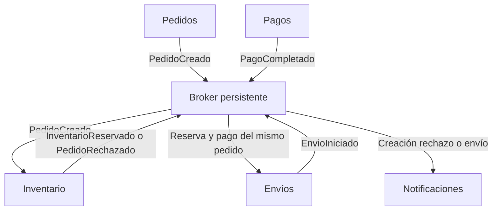

# Aula EDA

Laboratorio educativo de **arquitectura orientada a eventos**. Permite crear pedidos, observar la publicación y consumo de eventos, simular pagos, provocar fallos y recuperar entregas. La lógica EDA se ejecuta realmente en Python; la interfaz muestra el estado del broker persistido en SQLite.

[Descargar la guía explicativa en Word](docs/Guia_proyecto_Aula_EDA.docx) · Arquitectura, instalación, ejercicios y respuestas.

## Ejecutar

El proyecto también incluye una versión online lista para Vercel. Conserva el motor EDA en Python y guarda una sesión independiente por navegador. Consulta [cómo funciona el despliegue](docs/Despliegue_Vercel.md). Las instrucciones siguientes corresponden a la versión local con SQLite en disco.

Requisito: **Python 3.10 o superior**. No requiere paquetes adicionales, Docker, cuenta de pago ni conexión a Internet durante la ejecución.

```bash
git clone https://github.com/jc2709/eventos.git
cd eventos
python server.py
```

Abre **http://127.0.0.1:8000**. En Windows también puedes ejecutar `start.bat` o `py -3 server.py`; en Linux/macOS, `sh start.sh` o `python3 server.py`. Detén el servidor con Ctrl+C. Si el puerto está ocupado, utiliza `python server.py --port 8001`.

El historial se guarda en `data/aula.sqlite3`, un archivo local ignorado por Git. Reiniciar laboratorio elimina exclusivamente los datos de esta práctica y restaura el stock inicial.

## Primera práctica en cinco minutos

1. Crea un pedido de dos cuadernos en modo paso a paso. El evento `PedidoCreado` aparece, pero el stock sigue en ocho.
2. Pulsa **Procesar una entrega**. Inventario reserva dos unidades y publica `InventarioReservado`. El stock queda en seis.
3. Sigue procesando las entregas. Observa que Envíos espera el pago.
4. Pulsa **Simular pago** en el pedido reservado. Se publica `PagoCompletado`.
5. Procesa el resto de las entregas. Envíos correlaciona reserva y pago, publica `EnvioIniciado` y Notificaciones genera un mensaje ficticio.
6. Activa el fallo de Notificaciones y crea otro pedido. Procesa la cola: Inventario funciona aunque Notificaciones falle. Tras tres intentos la entrega queda fallida.
7. Desactiva el fallo, pulsa **Reintentar fallidos** y procesa otra vez. El stock no se descuenta de nuevo.

## Componentes y eventos

| Componente | Consume | Publica |
| --- | --- | --- |
| Pedidos | Comando del usuario | PedidoCreado |
| Pagos | Comando de pago simulado | PagoCompletado |
| Inventario | PedidoCreado | InventarioReservado o PedidoRechazado |
| Envíos | InventarioReservado y PagoCompletado | EnvioIniciado |
| Notificaciones | PedidoCreado, PedidoRechazado, EnvioIniciado | Ninguno |



Un evento registra un hecho pasado e incluye `id`, `type`, `producer`, `correlation_id`, `occurred_at`, `version` y `payload`. `correlation_id` es el identificador completo del pedido. `seq` es la posición local en el historial, añadida a las consultas.

## Cómo funciona el broker

La publicación inserta un evento y una entrega independiente para cada suscriptor dentro de la misma transacción. `step()` toma una entrega pendiente y llama únicamente a su consumidor. Los efectos SQLite del consumidor, los nuevos eventos y la confirmación se guardan juntos. Si el consumidor falla, un SAVEPOINT revierte sus efectos y se registra el intento fallido. La entrega pasa a `retry`; en el tercer fallo pasa a `failed`, la cola de fallos visible.

Las entregas completadas no son elegibles para reintentar. La restricción `UNIQUE(event_id,consumer)` evita duplicar suscripciones para un evento, y la notificación tiene una restricción única por evento. La API rechaza un segundo pago para el mismo pedido. Estas garantías son locales: incorporar correo, pagos externos o un broker distribuido exigiría idempotencia específica y transacciones coordinadas mediante outbox u otro patrón apropiado.

La coreografía está en `eda/consumers.py`: ningún consumidor llama a otro. Envíos conserva dos señales por pedido y solo publica cuando recibió ambas, independientemente del orden. La interfaz consulta el estado cada 0,8 segundos; el trabajador automático procesa una entrega cada 0,6 segundos. Son intervalos educativos, no un streaming de alto rendimiento.

## Código

```text
server.py               Servidor HTTP local y trabajador automático
eda/broker.py           Publicación, suscripciones, entregas y reintentos
eda/application.py      Productores, estado, validaciones y consultas
eda/consumers.py         Inventario, Envíos y Notificaciones
web/                    Interfaz HTML CSS JavaScript
tests/test_eda.py        Pruebas de comportamiento y recuperación
docs/                   Explicación y ejercicios del proyecto
```

## Pruebas

```bash
python -m unittest discover -s tests -v
```

Las 19 pruebas verifican publicación asíncrona, reservas, rechazo por stock, correlación entre pedidos, inversión del orden de consumo, pago duplicado, aislamiento de fallos, rollback de efectos, recuperación tras reinicio, validación y reinicio de la práctica. También comprueban el flujo entre invocaciones online y la independencia de las sesiones de los alumnos. GitHub Actions ejecuta el mismo comando.

## Alcance

Es una aplicación EDA modular de un solo proceso con un broker educativo SQLite. Conserva un registro de eventos y estado actualizado; **no implementa event sourcing completo** ni reconstrucción del estado desde cero. No incorpora Kafka/RabbitMQ, CEP completo, circuit breakers, backoff temporal, múltiples servidores, autenticación, pagos ni mensajes reales. El servidor está enlazado a localhost por defecto y está pensado para prácticas locales.

## Base teórica

Carlos Ramos Montes. *Sesión 3 Arquitectura orientada a eventos*, curso Desarrollo Adaptativo e Integrado de Software, FIIS, Universidad Nacional de Ingeniería. Material proporcionado para esta práctica; la portada indica 2024-II. Se aplican productores, eventos, broker, consumidores, pub/sub, coreografía, correlación, persistencia, errores, monitorización y pruebas. El PDF original no se redistribuye en este repositorio.
